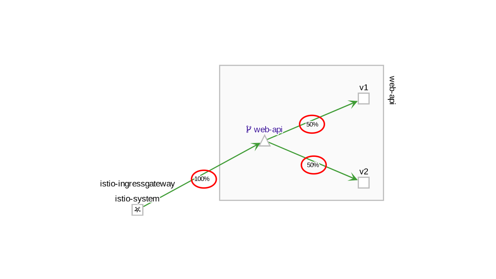

## minimal istio request routing sample on minikube

i used this scenario to test the behaviour of ingress traffic routing (used for blue/green and canary deployments). in the end it is made up of two applications: web-api in 2 versions (v1 and v2) and a frontend that simply passes request thru to web-api.

## web-api

the web-api application reads a string ("Version 1" or "Version 2") from an environment variable that is set in the deployment.yaml and returns that string when called with the URI /test:

```
curl http://192.168.99.100:31380/test
=> Version 1
curl http://192.168.99.100:31380/test
=> Version 2
```

### prep 

use docker environment of minikube

```
eval $(minikube docker-env)
```

### web-api

cd web-api

```
docker build -t web-api:1 .
```

### deploy

cd deployment

if needed: 

`kubectl label namespace default istio-injection=enabled`

```
kubectl apply -f service.yaml 
kubectl apply -f deployment.yaml 
kubectl apply -f istio-ingress.yaml 
```

### test

```
while true; do curl http://192.168.99.100:31380/test; sleep 1; done
```

--> accessing service web-app thru ingress gateway at nodeport 31380

==> v1 / v2 balanced

### istio

```
kubectl apply -f destinationrule.yaml
kubectl apply -f istio-svc-web-app.yaml
```

==> 80% should go thru v1, 20% thru v2, BUT IT DOESN'T

## add frontend

the frontend app simply passes a GET request on /get thru to web-api /test. result:

```
curl 192.168.99.100:31380/get
=> Frontend calling Web-API, Result:  => Version 1
```

cd frontend

```
docker build -t frontend:1 .
```

## deploy frontend

cd deployment

```
kubectl apply -f service-w-frontend.yaml 
kubectl apply -f deployment-w-frontend.yaml  
```

No you can test both scenarios: 

calling the GET /test URI of web-api directly (as defined in istio-ingress.yaml):

```
while true; do curl http://192.168.99.100:31380/test; sleep 1; done
```
you can see that 100% of the traffic goes to the web-api service and although an istio virtualservice (istio-svc-web-app.yaml) is providing a 80/20 weight between v1 and v2, in reality the traffic is evenly split (50/50). not what i would expect.

now calling the GET /get URI of the frontend app:

```
while true; do curl http://192.168.99.100:31380/get; sleep 1; done
```

now the istio virtualservice is working as expected: ~80% of the requests go to v1, ~20% g to v2.
